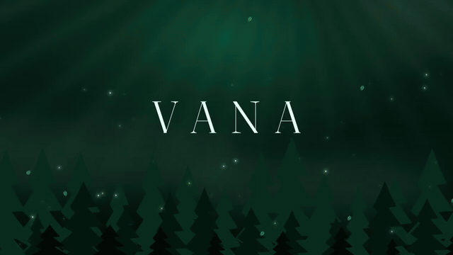
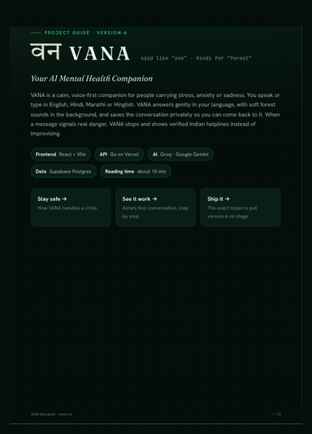
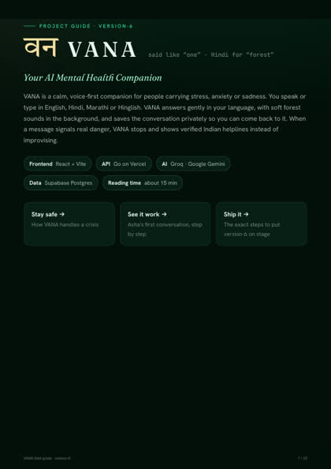
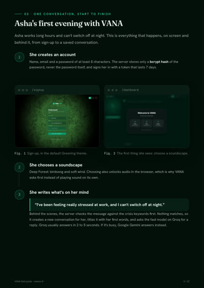
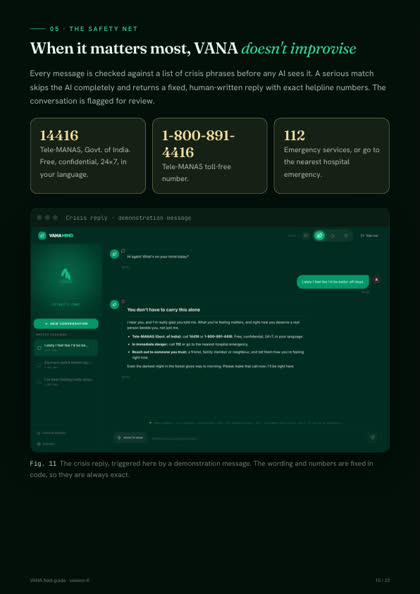
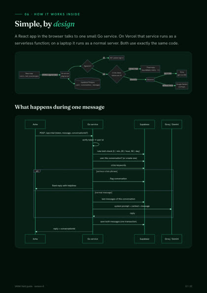

# 🌿 VANA
## Your AI Mental Health Companion

<p align="center">
<a href="https://vana-mind.vercel.app"></a>
</p>

> **Transitioning from structure to healing.** VANA is a biophilic digital triage system that bridges the clinical gap with nature-inspired design and zero-friction AI support.

---

<div align="center">

### ▶ See VANA in action

<!-- VIDEO-PLAYER: replace this line with the github.com/user-attachments/assets/... link for an inline player -->

<a href="docs/media/VANA-demo.mp4"></a>

<sub>3-minute narrated walkthrough · <a href="docs/media/VANA-demo.mp4"><b>Watch the full video (1080p)</b></a> · <a href="docs/media/VANA-demo.srt">Subtitles</a></sub>

<br><br>

### 📖 The VANA Field Guide

<table>
<tr>
<td align="center" valign="middle" width="40%">
<a href="docs/VANA-Field-Guide.pdf"></a>
</td>
<td valign="middle">

**22 pages, end to end:**

- 🌱 What VANA does, and why
- 💬 One conversation, start to finish
- 🛡️ The crisis safety net (Tele-MANAS 14416 · 112)
- 🧭 Architecture, API and data
- 🚀 Run it locally and ship it

<a href="docs/VANA-Field-Guide.pdf"></a>
<a href="docs/VANA-Field-Guide.pdf?raw=true"></a>

</td>
</tr>
</table>

<table>
<tr>
<td align="center"><a href="docs/VANA-Field-Guide.pdf"></a><br><sub>Cover</sub></td>
<td align="center"><a href="docs/VANA-Field-Guide.pdf"></a><br><sub>One conversation</sub></td>
<td align="center"><a href="docs/VANA-Field-Guide.pdf"></a><br><sub>The safety net</sub></td>
<td align="center"><a href="docs/VANA-Field-Guide.pdf"></a><br><sub>Architecture</sub></td>
</tr>
</table>

</div>

---

## 🚀 Overview

VANA is a full-stack mental health platform designed to lower cortisol through biophilic design while providing clinical-grade AI triage. Built with a modern **React + Go + PostgreSQL** stack, it features real-time crisis detection, RAG-based clinical knowledge, and a cinematic, nature-inspired UI.

---

## 🛠️ Technology Stack

- **Frontend**: React 18, TypeScript, Vite, Tailwind CSS
- **Backend**: Go (Golang) 1.22
- **Database**: PostgreSQL 16 with `pgvector` for RAG
- **AI Orchestration**: Groq (Tier 1 Speed) + Gemini (Tier 2 Clinical Logic)
- **Deployment**: Docker & Docker Compose

---

## 🚀 Quick Start

### Prerequisites
- **Docker Desktop**
- **Git**

### Local Deployment (Docker)

```bash
# 1. Clone repository
git clone https://github.com/fl-prasad-alai/VANA.git
cd VANA

# 2. Start all services
docker compose up -d

# 3. Seed the database (Initial setup)
docker exec -i emerald-moss-postgres psql -U postgres -d emerald_moss < docs/SEED_DATA.sql

# 4. Open application
Frontend: http://localhost:5173
Backend API: http://localhost:3000/api/health
Database Admin: http://localhost:5050
```

---

## 📁 Project Structure

```
VANA/
├── src/                          # React Frontend
│   ├── components/               # UI Components (CinematicBackground, VitalityCore)
│   ├── pages/                    # Dashboard, Login, Signup
│   ├── contexts/                 # Auth & Theme State
│   └── hooks/                    # Custom React Hooks
│
├── api/                          # Go Backend
│   ├── database/                 # PostgreSQL + pgvector Client & Models
│   ├── handler/                  # HTTP Handlers (Vercel compatible)
│   ├── middleware/               # Crisis detection & Auth
│   ├── orchestration/            # Groq + Gemini AI Provider Logic
│   └── main.go                   # Main Entry Point
│
├── docs/                         # Documentation
│   ├── TESTING_GUIDE.md          # Comprehensive Testing Instructions
│   ├── API_SPEC.md               # API reference
│   ├── SUPABASE_SCHEMA.sql       # PostgreSQL Schema
│   └── SEED_DATA.sql             # Test Credentials & Data
│
├── docker-compose.yml            # Full-stack Orchestration
└── Dockerfile.backend            # Multi-stage Go Build
```

---

## 🎨 Design System: "Biophilic Zen"

VANA utilizes a curated aesthetic to reduce user anxiety:
- **Cinematic Backgrounds**: Dynamic, nature-inspired visual depth.
- **Glassmorphism**: Frosted glass UI elements for a premium, modern feel.
- **Biophilic Palette**: Deep evergreens, morning mists, and earthy tones.
- **Micro-animations**: Smooth transitions for a "living" interface.

---

## 🧠 AI & Safety Protocol

### 🛡️ Crisis Interceptor
A specialized middleware that monitors every message for safety keywords (self-harm, ideation). If detected, it immediately triggers a safety interceptor with verified helpline resources before the AI even processes the request.

### 📚 RAG (Retrieval-Augmented Generation)
Using `pgvector`, VANA retrieves evidence-based clinical knowledge from a local vector store to ground AI responses in professional mental health practices.

---

## 🔐 Authentication
- **Secure JWT**: 7-day expiration with secure token handling.
- **Mock Auth Layer**: Local development simulates Supabase-style authentication for easy testing and portability.

---

## 🧪 Testing

For detailed testing steps, credentials, and API examples, please refer to the **[Testing Guide](docs/TESTING_GUIDE.md)**.

**Test Accounts:**
- **Admin**: `admin@vana.com` / `password123`
- **User**: `user@example.com` / `password123`

---

## 🤝 Contributing

1. Fork the repository.
2. Create your feature branch (`git checkout -b feat/amazing-feature`).
3. Commit your changes (`git commit -m 'feat: add amazing feature'`).
4. Push to the branch (`git push origin feat/amazing-feature`).
5. Open a Pull Request.

---

## 📄 License
MIT License - See LICENSE file

---
**VANA**: Where nature meets neuroscience.
**Status**: 🚀 Production Ready | **Version**: 1.0.0
